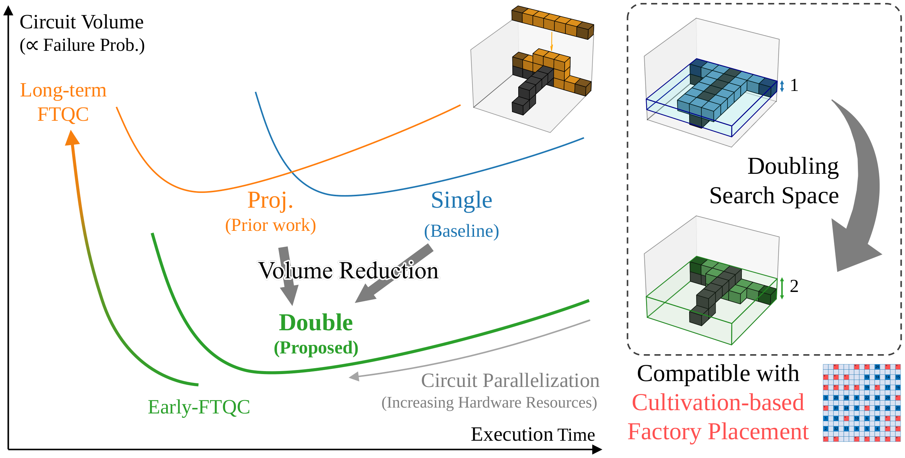

# Lattice Surgery

This repository contains the source code and implementations for lattice surgery algorithms and their performance analysis on quantum circuits.

This is also the supplemental material for our paper, "Bounded-depth spacetime lattice surgery for resource-efficient fault-tolerant quantum computation" (2026) by Kou Hamada, Hiroki Hamaguchi, Yosuke Ueno, Yasunari Suzuki, Teruo Tanimoto, and Nobuyuki Yoshioka.

https://arxiv.org/abs/2606.21192



## Quick Start

For a quick introduction, see the [tutorial.ipynb](tutorial.ipynb) notebook in the root directory.

## Setup Instructions

### Python

We use [uv](https://github.com/astral-sh/uv) for Python package management.
To set up the environment:

```bash
# Install uv (if not already installed)
curl -LsSf https://astral.sh/uv/install.sh | sh

# Sync dependencies and create virtual environment
uv sync
```

This will create a virtual environment at `.venv` and install all dependencies specified in `pyproject.toml`.

To activate the virtual environment:
```bash
source .venv/bin/activate
```

### C++

The C++ implementation requires a C++17 compatible compiler (e.g., g++-13).

See [tutorial.ipynb](tutorial.ipynb) or [src/README.md](src/README.md) for compilation and usage instructions.

### Git Submodules

If necessary, initialize and update git submodules with:

```bash
git submodule update --init --recursive
```

We use TeleportRouter.jl as a submodule for the EDPC algorithm.

## Project Structure

- `src/` - Main source code and algorithms (see [src/README.md](src/README.md) for details)
  - `cpp/` - C++ implementation of lattice surgery algorithms
  - `ipynb/` - Jupyter notebooks for analysis and visualization
  - `TeleportRouterSub/` - EDPC algorithm integration
- `problem/` - Problem generation and circuit benchmarks
- `data/` - Input circuits and experimental data
- `doc/` - Documentation and references
- `tutorial.ipynb` - Quick start tutorial

For detailed information on reproducing experimental results and using the algorithms, please refer to [src/README.md](src/README.md).

## License

This project is licensed under the MIT License - see the [LICENSE](LICENSE) file for details.
