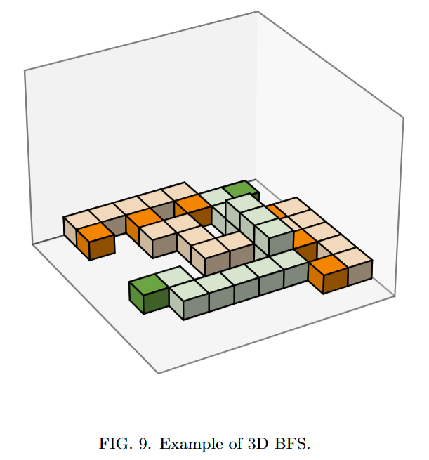

# cpp

C++ files for the lattice surgery.

## Usage

Basically, we are supposed to run through Python.

ToDo: Add more details.

## Structure

<!-- You can update this by ''tree /f'' command -->
```bash
├── README.md
├── allocator
│   ├── allocator.hpp
│   └── sa_solver.hpp
├── demo.cpp
├── log_all.cpp
├── log_metrics.cpp
├── main.cpp
├── scheduler
│   ├── doubleTimeSlice.hpp
│   ├── projective.hpp
│   ├── routingError.hpp
│   ├── scheduleResult.hpp
│   ├── scheduleResultValidator.hpp
│   └── singleTimeSlice.hpp
└── util
    ├── LifetimeArray.hpp
    ├── constants.hpp
    ├── instruction.hpp
    ├── instructionDependencyManager.hpp
    ├── load_instance.hpp
    ├── problem.hpp
    ├── solveBest.hpp
    └── timer.hpp
```

### main

* main (todo)
* main_embed (???)
* main_randomize_allocation (???)

### allocator

The allocator finds places for the data qubits in the chip.

* randomAllocator (randomly allocate qubits)

### Scheduler

The scheduler finds surgery paths for a given instruction.

* singleTimeSlice (Find path within a single code beat)
* multiTimeSlice (Find path within multiple code beats)

In the sense of the FIG.9 in [Efficient and high-performance routing of lattice-surgery paths on three-dimensional lattice](https://arxiv.org/abs/2401.15829), the scheduler finds path in a single time slices or multiple time slices.


